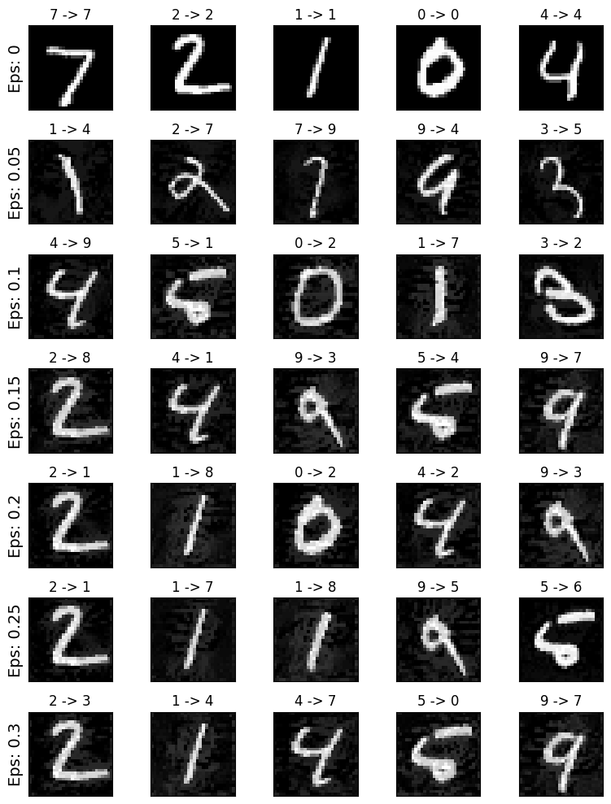
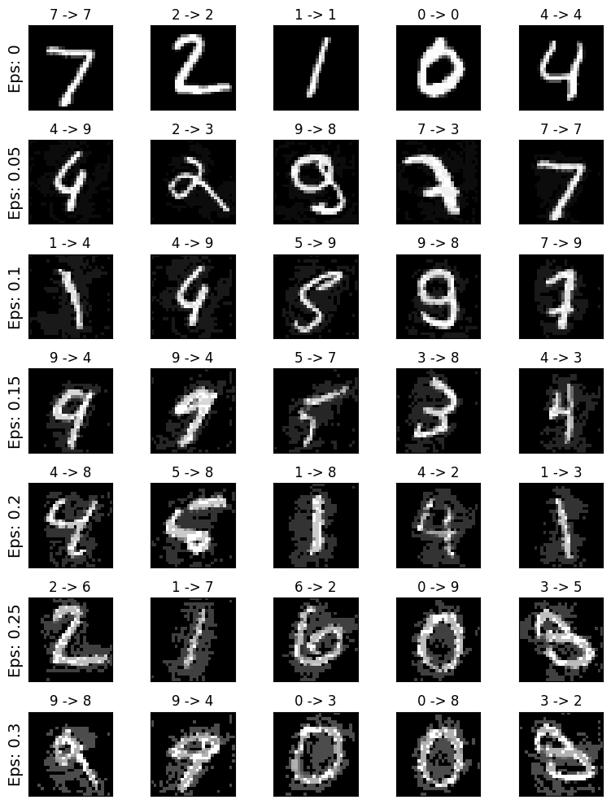

# targeted-PGD

This project implements a targeted PGD & FGSM attack on the LeNet5 model.

## Introduction
The targeted PGD attack is a method used to generate adversarial examples that are specifically designed to be misclassified by the LeNet5 model. This attack aims to find the minimum perturbation required to change the predicted class of an input image to a target class.

## Usage
To use this project, follow these steps:

1. Clone the repository:
  ```bash
  git clone https://github.com/d2n0s4ur/targeted-PGD.git
  ```

2. Install the required dependencies:
  ```bash
  pip install -r requirements.txt
  ```

3. Run the attack script with jupyter notebook:
  ```bash
  jupyter notebook code/run.ipynb
  ```

## Results
The results of the targeted PGD attack on the LeNet5 model are shown below:




The results of the targeted FGSM attack on the LeNet5 model are shown below:




## References
[1] [Multiclass ASMA vs Targeted PGD Attack in Image Segmentation](https://arxiv.org/pdf/2208.01844.pdf)

[2] [Explaining and Harnessing Adversarial Examples](https://arxiv.org/abs/1412.6572)

[3] [ADVERSARIAL EXAMPLE GENERATION](https://pytorch.org/tutorials/beginner/fgsm_tutorial.html)

[4] [Adversarial examples in the physical world](https://arxiv.org/abs/1607.02533)
